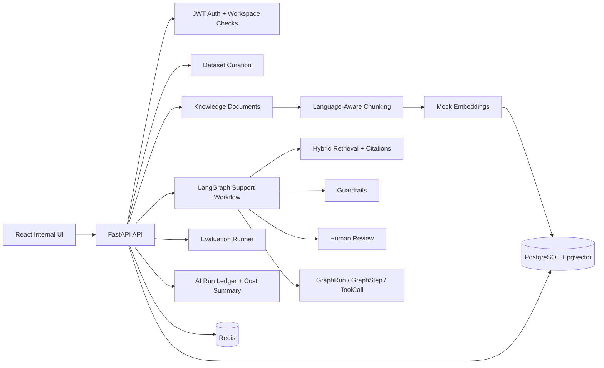

# Multilingual Agentic Support Intelligence Platform

A production-style AI/backend portfolio project for multilingual support intelligence: dataset curation, knowledge ingestion, RAG, LangGraph workflows, human review, evaluation, and token/cost observability.

This is not a tutorial chatbot. It is a local-first internal AI platform designed to demonstrate backend architecture, LLM application engineering, multilingual product thinking, cost discipline, observability, and interview-defensible tradeoffs.

## Problem

SaaS, gaming, entertainment, healthcare, and education teams receive support and community messages in English, Japanese, and Chinese. They want generative AI support, but production systems need more than a prompt box:

- reliable knowledge retrieval with citations
- workspace permission isolation
- language preservation
- human review for risky cases
- evaluation by language and baseline
- token/cost/latency tracking
- traceable workflow execution
- honest scale and deployment boundaries

## Solution

The platform lets a small internal team import multilingual conversations, label examples, upload policy/FAQ documents, run a governed LangGraph support workflow, inspect every graph step, resolve human reviews, evaluate results across baseline modes, and monitor token usage and estimated cost.

## Architecture



Core pillars:

1. Multilingual data platform
2. Knowledge and retrieval
3. Agent workflow
4. Quality and safety
5. Observability and cost

## Tech Stack

```text
Frontend: React, TypeScript, Vite
Backend: Python, FastAPI, Pydantic, SQLAlchemy, Alembic
Database: PostgreSQL, pgvector
Queue/cache: Redis
AI workflow: LangGraph
AI app layer: LangChain-style provider/tool boundaries
Testing: pytest, ruff, TypeScript checks
Runtime: Docker Compose, uv, npm
CI: GitHub Actions
```

## Implemented V1 Features

| Area | Implemented |
| --- | --- |
| Auth and tenancy | JWT auth, workspace creation, workspace membership checks |
| Dataset curation | JSONL import, multilingual language detection, message storage, manual labels |
| Knowledge ingestion | Text/Markdown upload, document versions, chunks, token counts, mock embeddings, pgvector storage |
| Retrieval | Vector scoring, multilingual lexical scoring, hybrid ranking, citations, retrieval traces, no-source detection |
| Agent workflow | LangGraph support workflow with graph runs, graph steps, tool calls, routing, and trace API |
| Guardrails | Prompt-injection checks, citation-required checks, language preservation, confidence scoring, review routing |
| Human review | Pending review queue, approve/edit/reject resolution, stored reviewer decision |
| Evaluation | JSONL cases, direct LLM baseline, vector RAG baseline, system v1 mode, per-language metrics |
| Observability | AI run ledger, token/cost/latency estimates, cost summary, graph trace viewer |
| Frontend | Browser UI for the full local demo path |

## LangGraph Workflow

```text
detect_language
classify_intent
retrieve_evidence
compress_context
draft_response
check_policy_and_tone
score_confidence
route_review_or_finalize
finalize_response
```

The workflow routes to human review for low confidence, missing citations, unsupported answers, unsafe or injected input, high token cost, high safety risk, escalation need, or language-specific quality failure.

## Token Economy

Token cost is a first-class requirement. The system:

- avoids sending raw long documents to model calls
- chunks and retrieves evidence before generation
- estimates prompt, completion, and total tokens
- records model, purpose, language, latency, estimated cost, and cache-hit fields
- exposes cost summaries by workspace and purpose
- keeps deterministic code in front of LLM-like calls where possible

## Evaluation

Evaluation compares:

```text
direct_llm: no retrieval baseline
vector_rag: retrieval baseline
system_v1: LangGraph workflow with retrieval, guardrails, and review routing
```

Stored metrics include case pass rate, human-review routing accuracy, language preservation, citation accuracy, groundedness, latency, prompt tokens, and estimated cost per run. Metrics are grouped by language and mode so English, Japanese, and Chinese regressions are visible.

## Local Demo

Start the stack:

```bash
docker compose up -d --build
make backend-migrate
```

Open:

```text
Frontend: http://localhost:5173
API:      http://localhost:8000
Health:   http://localhost:8000/health
```

Browser demo path:

```text
register/login
-> create workspace
-> import multilingual dataset
-> upload knowledge document
-> create agent
-> run support workflow
-> inspect graph trace
-> resolve human review
-> run evaluation
-> inspect cost dashboard
```

Detailed walkthrough: `docs/demo-script.md`.

## Validation

Current validation commands:

```bash
make backend-lint
make backend-test
make frontend-test
make frontend-build
git diff --check
```

Latest milestone validation passed with 54 backend tests, frontend TypeScript checks, production build, backend lint, and Docker health/CORS checks.

## Documentation

- `docs/architecture-tree.md`: quick architecture and tool map
- `docs/demo-script.md`: browser walkthrough
- `docs/interview-explanation.md`: interview-ready explanation
- `docs/resume-bullets.md`: resume bullet drafts
- `docs/known-limitations.md`: honest limitations
- `docs/scale-path.md`: migration path from local v1 to larger deployments
- `docs/tickets/`: milestone implementation records
- `docs/learning/`: learning notes by milestone

## Scale Path

V1 is local-first and honest about scope. The documented migration path is:

| Scale | Direction |
| --- | --- |
| 100 records | Docker Compose, one API, PostgreSQL/pgvector, Redis |
| 1,000 records | background jobs, indexes, cached retrieval, pagination |
| 10,000 records | batch embeddings, async evaluation, worker queues, stricter observability |
| 1M+ records | managed PostgreSQL/Cloud SQL, object storage, analytics warehouse, dedicated vector index, horizontal workers, Cloud Run, Terraform, monitoring |

The 1M+ path is documented, not implemented in v1.

## Known Limitations

- Model and embedding providers are deterministic mocks for local safety and test stability.
- Evaluation is deterministic and regression-oriented, not a replacement for human rubric review.
- Japanese and Chinese lexical search is intentionally simple in v1.
- PII redaction, full audit logging, enterprise SSO, Terraform, and cloud deployment are postponed.
- Cost values are estimates, not billing-grade accounting.

See `docs/known-limitations.md` for the full list.

## Portfolio Positioning

This project is aimed at backend/AI application roles where employers care about more than prompt demos: LLM system design, LangGraph workflows, RAG quality, multilingual behavior, token economy, human review, evaluation, observability, testing, and clean implementation boundaries.
