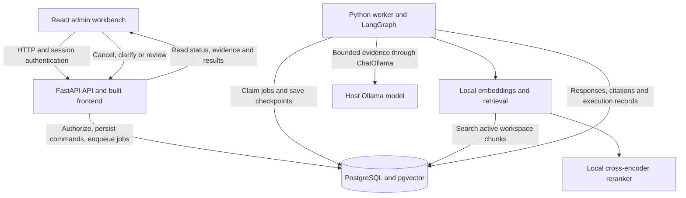

# Multilingual Support Workbench

A local RAG application for a small support team. Upload company knowledge, process customer
questions, inspect the AI's evidence and execution, and intervene when a response needs review.
The interface is branded **Aster** and supports English, Japanese and Chinese questions.

**Status: working local demo.** The core workflow is implemented and tested, but answer-quality
and production-release gates are not all met. See [verification and limitations](#verification-and-limitations).

## How it works

```text
Customer question → database → authorized retrieval → AI processing
                 → answer, citations and execution records → administrator inspection/intervention
```

1. An administrator uploads policies in **Knowledge**. The worker splits and indexes them.
2. An operator submits a question in **Workbench**, or imports messages from a JSONL file.
3. The workflow retrieves permitted knowledge and passes bounded evidence to the local model.
4. The result is an automatic cited answer, a request for review, a request for missing
   knowledge/details, or a retained **Set aside** outcome for irrelevant input.
5. Staff inspect **Response**, **Workflow**, **Sources** and **History**, then take the permitted
   next action. Linked retries and clarifications preserve the original message and prior attempts.

New messages default to **Match question**. The backend detects EN/JA/ZH from the question's
script, and the model is instructed to answer in that language even when the evidence uses
another language. Citation quotations retain their original language. An explicit language
choice is available for ambiguous input, including Japanese written entirely in kanji.

Answers and approvals stay inside the workbench. The app does not send customer messages,
issue refunds or execute account deletion.

## Main areas

| Area | What you can do |
| --- | --- |
| Workbench | Submit/import messages, search and filter the inbox, inspect responses, cancel processing and manage linked attempts. |
| Knowledge | Upload UTF-8 TXT/Markdown, inspect originals and versions, test retrieval, replace documents and withdraw/restore knowledge. |
| Quality | Inspect model usage, historical retrieval evaluations and direct/vector/hybrid/governed answer comparisons. |
| Settings | Set the language fallback, inspect provider configuration, and change/remove existing workspace memberships. |

The backend enforces permissions and workspace boundaries:

| Role | Capabilities |
| --- | --- |
| Viewer | Inspect permitted workspace data, sources and processing records. |
| Operator | Also submit/import messages, cancel work, and perform reviews allowed for the case type. |
| Admin | Also manage knowledge and memberships/settings, and approve/edit policy-exception or unclassified drafts. |

Missing-evidence responses cannot be approved as supported answers. Request clarification or
add knowledge and start a new attempt. Cancellation prevents later publication, but an
in-flight model call may finish. It does not undo an already recorded approval.

## Run locally

For the packaged demo, install **Docker Desktop with Compose**, **Python 3.12**, and **Ollama**.
Keep Docker and Ollama running. Initial container and model downloads require internet access
and local disk space. Run from the repository root:

```powershell
python scripts/manage.py release-up
python scripts/manage.py release-seed
python scripts/manage.py release-prepare-model
ollama pull qwen2.5:7b
```

The preparation command downloads the embedding and reranking models; Ollama downloads the
answer model. Enable automatic generation by adding or updating these entries in the generated
`.artifacts/m6/release.env`, preserving its existing database password:

```dotenv
ASI_GENERATION_MODE=local_ollama
ASI_OLLAMA_MODEL=qwen2.5:7b
ASI_OLLAMA_URL=http://host.docker.internal:11434
```

Apply the configuration:

```powershell
python scripts/manage.py release-up
```

Open [localhost:8011](http://localhost:8011). Sign in with a generated account from
`.artifacts/m6/release-credentials.json`. Keep this file private; there is no shared default
password or public registration flow. Seeding creates synthetic accounts and workspaces,
not a populated knowledge base.

For your first question, sign in as an administrator, upload a policy in **Knowledge**, wait
for indexing, and ask about it in **Workbench**. [Sample synthetic policies](evals/corpus/v1)
are available for experimentation. [The runbook](docs/RUNBOOK.md) covers setup, credentials,
model preparation and troubleshooting.

Without the `local_ollama` setting, generation defaults to **manual development mode** and
waits for an attributable human contribution. Retrieval is still real. This mode does not call
an OpenAI API. Automatic local generation uses the configured Ollama model.

The packaged app serves built frontend assets from FastAPI and uses separate database/model
volumes under Compose project `asi-release-v1`. Stop it while preserving data with:

```powershell
python scripts/manage.py release-down
```

## Architecture

The packaged app has three Docker services: an API that also serves the built frontend,
a background worker, and PostgreSQL. Ollama runs separately on the host. Browser requests
go through the API; the browser never accesses the database or model directly.



The API owns authentication, workspace authorization and user commands. Long-running ingestion
and answer generation run in the worker. Jobs use leases and publication checks; LangGraph
checkpoints retain workflow state between executions. PostgreSQL is the source of truth for
business data and processing records. The frontend polls the API for progress.

Development uses a separate Vite frontend service instead of serving built assets from FastAPI.
The development and packaged stacks have separate databases and model-cache volumes.

- **Frontend:** React, TypeScript and Vite.
- **Backend:** FastAPI, SQLAlchemy and PostgreSQL.
- **RAG:** local multilingual embeddings, pgvector search, BM25, rank fusion and reranking.
- **Workflow:** LangGraph with PostgreSQL checkpoints and a durable job worker.
- **Model integration:** LangChain text splitting and ChatOllama for local generation.
- **Records:** original messages, document versions, retrieval traces, model calls, responses
  and attributable human decisions.

One worker runs the bounded support workflow. There is no Redis or required cloud platform.
This is a support-processing application, not a general-purpose agent builder.

```text
backend/app/modules/    Authentication, workspaces, knowledge, messages, reviews and quality
backend/app/workflows/  LangGraph orchestration and persistent checkpoints
backend/app/providers/ Retrieval models and response generation
frontend/src/features/ Workbench, knowledge, quality, settings and login
backend/tests/         Unit and PostgreSQL integration tests
frontend/tests/e2e/    Browser journeys
evals/                 Synthetic policies, frozen cases and scoring tools
scripts/               Runtime, provisioning, verification and backup commands
infra/                 Packaged image and Compose configuration
docs/                  Architecture, contracts, evidence and development guides
```

See [the detailed topology and data flow](docs/ARCHITECTURE.md) and [RAG design](docs/RAG.md).

## How the RAG system works

Retrieval-augmented generation supplies relevant company passages to the model when answering
a question. Uploading a document indexes it for retrieval; it does not train the answer model.

### 1. Ingest and version knowledge

An authorized administrator uploads a UTF-8 TXT or Markdown file. The backend retains original
bytes, a checksum and a document version, then queues ingestion. The worker normalizes text,
splits it into bounded passages using the LangChain-based splitter, and preserves headings and
character offsets so each passage can be traced back to its source.

The local multilingual E5 model embeds the passages. PostgreSQL stores their text, vectors,
lexical search data and version references. A completed indexing job activates the new version
in one transaction. A failed replacement does not replace the previously active version.
Withdrawn documents and superseded versions are excluded from new retrieval.

### 2. Retrieve evidence for the question

The API saves the original message and a processing job. The worker checks the current actor's
workspace access before retrieving data. Ordinary questions currently use **vector search plus
reranking**:

```text
Question → multilingual query embedding → active workspace chunks in pgvector
         → top 20 by cosine similarity → cross-encoder reranking → up to 5 passages
```

The embedding model is `intfloat/multilingual-e5-small`; the reranker is
`cross-encoder/mmarco-mMiniLMv2-L12-H384-v1`. Embeddings allow a question and its supporting
passage to use different languages. The reranker scores the question together with each
candidate passage to improve their order. These scores measure relevance, not factual certainty.

The retrieval engine also supports BM25 and hybrid strategies. BM25 matches lexical terms,
including identifier tokens and Chinese/Japanese character pairs. Hybrid retrieval collects
up to 20 vector and 20 BM25 candidates from the same eligible workspace sources, merges their
rankings with reciprocal rank fusion, and keeps up to 20 candidates for final selection or
optional reranking. It does not simply add incomparable cosine and BM25 scores.

| Entry point | Current retrieval behavior |
| --- | --- |
| Ordinary Workbench message | Vector search plus reranking. |
| `direct_llm` comparison | No retrieval. |
| `vector_rag` comparison | Vector search. |
| `hybrid_rag` comparison | Vector + BM25 with rank fusion. |
| `system_v1` comparison | Hybrid retrieval through the governed support workflow. |

Hybrid retrieval is implemented, but it is not the default for every message. The saved trace
records the actual strategy, candidate IDs, available scores, exclusions and final ranking.

### 3. Build context and generate the answer

The worker packs up to five passages with their source identities into a context snapshot.
The serialized context is limited to 24,000 UTF-8 bytes; passages that do not fit are omitted
rather than silently truncated. This byte bound is not a guarantee against every model's token
limit. The snapshot and generation request are hashed for provenance.

In local mode, LangChain's `ChatOllama` sends the question and selected passages to Ollama.
The model returns a structured answer, selected source IDs, a routing decision and a reason.
It is instructed to use the evidence, preserve policy meaning and numbers, and translate the
answer into the question's selected language. Original passages remain unchanged.
In manual development mode, the graph pauses for a recorded human contribution instead.

### 4. Validate, route and retain the evidence

The backend validates selected sources and exact quotations and rechecks current permissions,
active document versions and cancellation before publication. An answer cannot grant itself
administrator approval or authorize an external action.

| Outcome | What happens |
| --- | --- |
| Answer | A cited response is recorded automatically for a routine question. |
| Review | An exception, conflict or sensitive request waits for human review. |
| Missing support | Staff must supply knowledge/details or otherwise intervene; unsupported approval is blocked. |
| Set aside | Irrelevant or meaningless input is retained without entering the review queue. |
| Processing failure | The error and execution state remain inspectable; the app does not substitute a canned successful answer. |

Source validation establishes where an answer's evidence came from. It does **not** prove
that the model interpreted it correctly. Routing and semantic accuracy remain imperfect.

### 5. Inspect and evaluate

Admins can follow a message into its attempts, retrieval trace, selected context, model-call
records, answer, citations and human decisions. **Workflow** exposes recorded stages and
durations; **Sources** opens exact document-version passages; **History** preserves interventions.
The ledger records provider/model identity, input and generated output tokens, duration, external charge and failures.

The evaluation tools compare retrieval strategies and the four answer pipelines against frozen
multilingual cases. Software regressions use deterministic providers; local-model evaluations
measure answer facts, support, language, routing and unsafe claims separately. A successful
demo case does not imply that the full quality benchmark passes. See the
[evaluation guide](evals/README.md) and [RAG failure and evidence contract](docs/RAG.md).

## Verification and limitations

At source checkpoint `d0e278d`, [CI passed](https://github.com/Infilong/AgenticSupportIntelligencePlatform/actions/runs/34445784085).
The language-matching fix passed 132 backend unit tests, 49 frontend tests and three focused
PostgreSQL tests. Chrome verified a Chinese answer backed by an English source.
[Current status](docs/STATUS.md) records dated evidence and failures.

The last independently reviewed local batch scored **20/30 for the governed workflow**, below
its unchanged **27/30** target. That batch predates the later routing/language fixes and has
not been rerun as a complete benchmark. Incorrect claims, missing facts and misclassification
remain possible. Valid source quotations establish provenance, not semantic correctness.

Current limits include:

- **Document formats:** TXT/Markdown only; no PDF, DOC/DOCX or OCR ingestion.
- **Agent features:** a fixed workflow; no configurable agents, arbitrary tool actions or embedded admin copilot.
- **Administration:** seeded accounts/workspaces and existing-member management; no signup, invitations or workspace-creation UI.
- **Providers:** manual or local Ollama generation; no remote OpenAI-compatible generation adapter.
- **Accounting:** recorded model identity, input and generated output tokens, duration, failures and external charge; total operating cost remains incomplete.
- **Operations:** broader recovery/security validation and native 200% browser zoom verification remain open.
- **Backups:** current backup/restore scripts target the development database, not the packaged database; offsite recovery is not established.

## Development and documentation

For development and tests, also install **Node.js 22**, **npm** and **uv**. The development
stack uses frontend port **5180**, API **8010** and PostgreSQL **5440**, separately from the
packaged demo:

```powershell
python scripts/manage.py init-env
python scripts/manage.py up
python scripts/manage.py seed-demo
python scripts/manage.py prepare-model
uv sync --project backend --frozen
python scripts/manage.py verify-prep
python scripts/manage.py verify-backend
python scripts/manage.py verify-integration
```

Run `npm ci`, `npm run build` and `npm test` from `frontend/`. See the
[runbook](docs/RUNBOOK.md) for development Ollama configuration and application browser tests.
`verify-browser` checks only the browser environment. `scripts/manage.py` is an operations
and testing dispatcher; a unified end-user business CLI is not implemented.

Local evidence in `.artifacts/` is excluded from Git. Committed execution records summarize
its scope, results and limitations. For agent-assisted development, start with [AGENTS.md](AGENTS.md)
and follow the relevant module guide and [development workflow](docs/DEVELOPMENT.md).

- [Architecture](docs/ARCHITECTURE.md)
- [RAG design and failure handling](docs/RAG.md)
- [Acceptance criteria](docs/ACCEPTANCE.md)
- [Current status and evidence](docs/STATUS.md)
- [Commands and recovery](docs/RUNBOOK.md)
- [Documentation freshness](docs/DOC_FRESHNESS.md)
