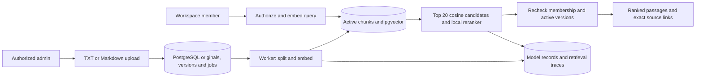

# Architecture and current topology

Inspected 2026-09-09 against application checkpoint `2379915` and retained evidence.
Foundation, knowledge ingestion and real retrieval exist; application generation remains
unfinished. [STATUS](STATUS.md) owns progress and verification, including execution boundaries.

## Current project topology

```text
AgenticSupportIntelligencePlatform/
├── AGENTS.md                   # Task routing and authority
├── REBUILD_PLAN.md             # Release requirements and target structure
├── compose.yaml               # Four-service development runtime
├── backend/
│   ├── migrations/versions/    # Application schema
│   ├── app/
│   │   ├── main.py             # FastAPI composition
│   │   ├── worker.py           # Job polling and handlers
│   │   ├── core/              # Settings, health, logging, body limits
│   │   ├── db/                # Engine, sessions and model base
│   │   ├── jobs/              # Claims, leases, cancellation and fencing
│   │   ├── modules/
│   │   │   ├── identity/      # Sessions, authentication and CSRF
│   │   │   ├── workspaces/    # Membership and roles
│   │   │   ├── knowledge/     # Documents, ingestion, retrieval and sources
│   │   │   └── usage/         # Model-call records
│   │   └── providers/         # Local embeddings/reranker and recorded calls
│   └── tests/                 # Unit and PostgreSQL integration tests
├── frontend/
│   ├── src/app/               # Shell and routing
│   ├── src/api/               # Client and generated API types
│   ├── src/features/auth/     # Login and session state
│   ├── src/features/settings/ # Workspace members
│   ├── src/features/knowledge/ # Upload, search and source inspection
│   └── tests/e2e/             # Browser journeys
├── evals/                     # Frozen multilingual corpus and retrieval evaluation
├── scripts/                   # Runtime, seeding, checks and evidence
├── infra/                     # Infrastructure guidance; Compose is at root
├── docs/plans/active/          # M1 history and M2 execution record
└── .github/workflows/         # Verification CI
```

Each substantive area has a local `AGENTS.md`, linked from the root director. These paths
exist now. The [target topology](../REBUILD_PLAN.md#target-project-topology) includes future
modules: separate retrieval, conversations/support/reviews, application workflows and
workbench/quality features are not implemented. Do not create empty target directories.

## Implemented data flow



LangChain splitting preserves sections and normalized offsets. Pinned local multilingual
embeddings and a cross-encoder provide real retrieval without an external API. Returned
passages are candidates, not generated answers. Model records include identity, local token
counts, duration and zero external cost. Crash-abandoned synchronous records need reconciliation.

## Runtime

Development: Vite frontend → FastAPI → PostgreSQL/pgvector; one Python worker reads the same
database. Planned local release: FastAPI serves built frontend assets, reducing this to app, worker,
database. Docker project `asi-rebuild-v1`; reserve loopback ports 5180, 8010, 5440 for development.
Development config uses API/database on 8010/5440, frontend on 5180 and a worker without a public
port. This describes configuration, not current service health.

The old `asi-verification` stack is separate and remains untouched. The old Redis container
belongs to that stack; it is not part of the rebuild. New volumes must carry the new namespace.

## V1 design requirements (including unfinished application behavior)

- PostgreSQL stores messages, knowledge originals/versions/chunks, runs, review, usage and jobs.
- A pending job and its business record commit atomically; queue transport cannot lose the job.
- One worker initially; short claims with leases, heartbeats, fenced updates and bounded retries.
- Never hold a DB transaction open while waiting on a provider. Model outcomes may be uncertain
  after a crash; preserve accounting uncertainty and prevent duplicate publication.
- Supported PostgreSQL LangGraph checkpoints persist workflow state. A review pause releases
  the worker; authorized resume continues the same graph through a scheduled job.
- Server authentication, roles and workspace scoping precede reads, writes and model dispatch.
- LangChain supplies selected integration/splitting components; LangGraph coordinates the graph.
- Domain services own rules; API routes, graph nodes and worker handlers call those services.
- Maintain distinct original message, linked attempt, draft, reviewed final and decision history.
- Use exact SQL vector search and a measured bounded lexical baseline; no broad new search stack.

Current retrieval uses vector candidates plus neural reranking. The original lexical/fusion
requirement remains an explicit discrepancy pending comparison or a release-plan decision;
the measured reranker evidence does not prove that original requirement completed.
Application message/run/review records and graph integration remain planned.

Refer to REBUILD_PLAN for the target repository topology; create files only when needed.

## Initial workbench design direction

```text
Workspace / provider mode                  New message   Import
Navigation     Inbox and filters           Selected message
Workbench      Needs attention / All       Original customer message
Knowledge      Search                     Response / next required action
Quality        Message + status           [1] [2] supporting sources
Settings       Message + status           Edit / approve / clarify / retry
                                          Processing details (expand)
                                          Attempt history (expand)
```

Citation selection opens a source drawer beside the response with exact version and section.
No separate response editor on a review page. On small screens, navigate list → detail → source,
with clear back navigation and focus restoration. Use a restrained neutral palette and one
accent color; status must also be expressed in text. This is a direction, not a reviewed UI.

## Foundation decisions and remaining workflow

M1 uses opaque PostgreSQL sessions with hashed random cookie tokens, Argon2 passwords,
absolute/idle expiry, synchronizer CSRF tokens and exact configured Origin validation. The
cookie name is distinct from archived apps because cookies are not isolated by port.
Membership writes lock the workspace and recheck authority/admin count inside the transaction.
The responsive React frontend implements login, workspace navigation and member roles.
OpenAPI generates its response types; release product journeys remain incomplete.
M2 specifies token/context limits, chunking parameters, source-equivalence mappings and initial
quality thresholds before tuning. M3 verifies worker lease timing and graph resume behavior.
These choices cannot weaken the release contract; material changes need approval.

## Implemented worker boundary

`jobs` owns payload-bound idempotency, priority, attempts, availability and leases. Claims use
`FOR UPDATE SKIP LOCKED`; every heartbeat/publication requires the current unexpired UUID lease.
Expired jobs are reclaimed or terminated after three attempts. Retry backoff is bounded.
Workspace authorization and publication use the same workspace-first lock order as membership
changes. Handlers execute outside transactions and cannot publish after revocation/cancellation.
The worker registers both database diagnostics and actual document indexing. Indexing checks
between bounded split/embedding operations and activates versions only after fenced publication.
Failed replacements preserve the previous active version.

Cancellation and lease checks occur between bounded ingestion batches; Python threads do not
preempt an executing handler.
LangGraph continuation and business-result publication remain distinct responsibilities.

LangGraph/PostgreSQL interrupt and recovery compatibility is tested in isolated schemas with
reconstructed connections/graphs. Application integration and process-kill recovery are not
proved. The next planned flow is original message → persisted run/job → graph and retrieval →
development-generation handoff → validated cited draft → administrator review/intervention.
The existing response-mode badge does not establish a working generation endpoint or live API.
