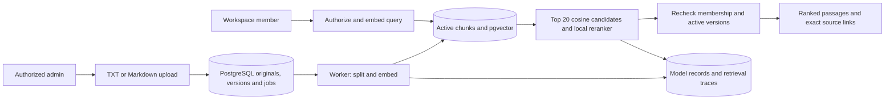

# Architecture and current topology

Updated 2026-09-09 for historical retrieval results and isolated built-asset packaging.
Foundation, knowledge ingestion, real retrieval and the message-to-development-draft API exist.
The workbench UI and human-review continuation are connected. [STATUS](STATUS.md) owns verification.

## Current project topology

```text
AgenticSupportIntelligencePlatform/
├── AGENTS.md                   # Task routing and authority
├── REBUILD_PLAN.md             # Release requirements and target structure
├── compose.yaml               # Four-service development runtime
├── backend/
│   ├── migrations/versions/    # Application schema
│   ├── app/
│   │   ├── main.py             # FastAPI composition
│   │   ├── worker.py           # Job polling and handlers
│   │   ├── core/              # Settings, health, logging, body limits
│   │   ├── db/                # Engine, sessions and model base
│   │   ├── jobs/              # Claims, leases, cancellation and fencing
│   │   ├── modules/
│   │   │   ├── identity/      # Sessions, authentication and CSRF
│   │   │   ├── workspaces/    # Membership and roles
│   │   │   ├── knowledge/     # Documents, ingestion, retrieval and sources
│   │   │   ├── conversations/ # JSONL imports, labels and saved-message admission
│   │   │   ├── support/       # Original messages, runs, handoffs and cited drafts
│   │   │   ├── reviews/       # Attributable decisions and fenced final responses
│   │   │   ├── evaluations/   # Workspace-scoped historical report registration and reads
│   │   │   └── usage/         # Model-call records
│   │   ├── providers/         # Local embeddings/reranker and recorded calls
│   │   └── workflows/         # LangGraph orchestration and PostgreSQL checkpoints
│   └── tests/                 # Unit and PostgreSQL integration tests
├── frontend/
│   ├── src/app/               # Shell and routing
│   ├── src/api/               # Client and generated API types
│   ├── src/features/auth/     # Login and session state
│   ├── src/features/settings/ # Workspace defaults, provider configuration and members
│   ├── src/features/quality/  # Model usage, historical retrieval checks and measurement gaps
│   ├── src/features/workbench/ # Inbox, run details, citations, development and review
│   ├── src/features/knowledge/ # Upload, search and source inspection
│   └── tests/e2e/             # Browser journeys
├── evals/                     # Frozen multilingual corpus and retrieval evaluation
├── scripts/                   # Runtime, seeding, checks and evidence
├── infra/                     # Infrastructure guidance; Compose is at root
├── docs/plans/active/          # M1 history, M2 gaps and M3 execution record
└── .github/workflows/         # Verification CI
```

Each substantive area has a local `AGENTS.md`, linked from the root director. These paths
exist now. The [target topology](../REBUILD_PLAN.md#target-project-topology) includes future
modules: a separate retrieval module and generation-pipeline evaluation execution are not yet implemented. Support currently owns original messages and their processing runs; retrieval
remains in knowledge. Do not create empty target directories.

## Historical evaluation records

Historical evaluation records are a separate read model, introduced by migration0014.
The local `app.register_evaluation` command accepts a bounded completed retrieval-strategies-v1
report, requires its primary-workspace administrator under the membership-writer lock, and
checks all160 case/probe traces against stored workspace/query/strategy/status. It stores an
immutable allowlisted projection, registering actor/time and report/source/corpus hashes.
Counts and nearest-rank p95 are recomputed from consistent recorded outcomes; registration
does not independently rescore source facts, rerun retrieval or certify supplied metadata.
Raw reports include foreign-workspace test data and remain local artifacts, never API responses.
Member-scoped list/detail routes return20 summaries per page and bounded150-case snapshots.
Quality separates model usage from historical comparisons, showing one strategy's30 cases and
lazy existing trace/source inspection. No generation quality or four-pipeline EVAL completion
follows from this capability; later source/document changes leave historical scores unchanged.

## Implemented knowledge data flow



The [span adapter](../backend/app/modules/knowledge/span_splitter.py) carries actual positions
through recursive partitions and LangChain merge/join hooks, including repetitive text.
Compatibility tests guard those private hooks when upgrading LangChain. Splitting preserves
sections and normalized offsets. Pinned local multilingual
embeddings and a cross-encoder provide real retrieval without an external API. Returned
passages are candidates, not generated answers. Model records include identity, local token
counts, duration and zero external cost. Crash-abandoned synchronous records need reconciliation.

## Runtime

Development: Vite frontend → FastAPI → PostgreSQL/pgvector; one Python worker reads the same
database. Local release: FastAPI serves built frontend assets with a worker and PostgreSQL;
`infra/Dockerfile.release` builds the locked frontend and copies only dist into `/app/web`.
Release project `asi-release-v1` exposes loopback port 8011 and has separate database/model
volumes; PostgreSQL has no published release port. Explicit frontend_dist enables only built
assets and known UUID workspace navigation routes. API/private/missing-asset errors remain
errors. The shell is no-store; public assets are immutable-cacheable. API responses default to
no-store and continue to require normal authentication, workspace checks and CSRF.
Docker project `asi-rebuild-v1` reserves loopback ports 5180, 8010, 5440 for development.
Development config uses API/database on 8010/5440, frontend on 5180 and a worker without a public
port. This describes configuration, not current service health.

The old `asi-verification` stack is separate and remains untouched. The old Redis container
belongs to that stack; it is not part of the rebuild. New volumes must carry the new namespace.

## V1 design requirements (including unfinished application behavior)

- PostgreSQL stores messages, knowledge originals/versions/chunks, runs, review, usage and jobs.
- A pending job and its business record commit atomically; queue transport cannot lose the job.
- One worker initially; short claims with leases, heartbeats, fenced updates and bounded retries.
- Never hold a DB transaction open while waiting on a provider. Model outcomes may be uncertain
  after a crash; preserve accounting uncertainty and prevent duplicate publication.
- Supported PostgreSQL LangGraph checkpoints persist workflow state. A review pause releases
  the worker; authorized resume continues the same graph through a scheduled job.
- Server authentication, roles and workspace scoping precede reads, writes and model dispatch.
- LangChain supplies selected integration/splitting components; LangGraph coordinates the graph.
- Domain services own rules; API routes, graph nodes and worker handlers call those services.
- Maintain distinct original message, linked attempt, draft, reviewed final and decision history.
- Use exact SQL vector search and a measured bounded lexical baseline; no broad new search stack.

The default retrieval path still uses vector candidates plus neural reranking.
[SQL BM25](../backend/app/modules/knowledge/bm25.py) and [RRF](../backend/app/modules/knowledge/fusion.py)
are available through five explicit search strategies. Knowledge search exposes an advanced method
selector; message workflows retain vector-rerank after the shared-corpus comparison found
a hybrid conflict-source regression (see evaluation evidence in STATUS).
Candidate history is available in knowledge results and the workflow retrieval inspector,
with a five-record preview and explicit full-list expansion (maximum40).
Both candidate implementations use the same active workspace/version/embedding-space population;
the shared query helper requires its caller to authorize the actor and hold the workspace lock.
Migration 0010 backfills versioned term frequencies and lexical length from immutable chunk text;
new ORM inserts derive the same metadata. Missing/wrong-version/non-object metadata fails closed
for lexical search. Migration0011 adds bounded candidate stages; older traces remain explicitly
unstaged. Traces preserve vector/BM25/fusion/reranker/final scores and exclusions, with no
fabricated missing scores or duplicated passage bodies. Membership is checked on every trace read.
This is not a 50k-chunk capacity or hybrid-quality claim.
[RAG design and audit](RAG.md) owns stage contracts, failure taxonomy and measured hardening gaps.
Application messages/runs, graph integration and human-review records now exist.

Refer to REBUILD_PLAN for the target repository topology; create files only when needed.

## Workbench navigation

```text
Workbench: searchable full-width message table → selected message
                                            ├── Response: result and permitted actions
                                            ├── Workflow: recorded stages and model evidence
                                            ├── Sources: exact cited passages and document versions
                                            └── History: decisions and linked processing attempts
```

Search, latest-attempt view, page and page size survive detail/back navigation in the URL.
The table requests 20 or 50 rows and unmounts while a message is open, avoiding hidden polling.
Tabs preserve mounted response controls while inspecting evidence. Source close restores the
originating tab and opener focus. Cancellation remains available above every tab when permitted.
Use a restrained palette and text status; the workflow is an inspector, not a graph editor.

## Foundation decisions and remaining workflow

M1 uses opaque PostgreSQL sessions with hashed random cookie tokens, Argon2 passwords,
absolute/idle expiry, synchronizer CSRF tokens and exact configured Origin validation. The
cookie name is distinct from archived apps because cookies are not isolated by port.
Membership writes lock the workspace and recheck authority/admin count inside the transaction.
The responsive React frontend implements login, workspace navigation and member roles.
OpenAPI generates its response types; release product journeys remain incomplete.
M2 specifies token/context limits, chunking parameters, source-equivalence mappings and initial
quality thresholds before tuning. M3 verifies worker lease timing and graph resume behavior.
These choices cannot weaken the release contract; material changes need approval.

## Implemented worker boundary

`jobs` owns payload-bound idempotency, priority, attempts, availability and leases. Claims use
`FOR UPDATE SKIP LOCKED`; every heartbeat/publication requires the current unexpired UUID lease.
Expired jobs are reclaimed or terminated after three attempts. Retry backoff is bounded.
Workspace authorization and publication use the same workspace-first lock order as membership
changes. Handlers execute outside transactions and cannot publish after revocation/cancellation.
The worker registers database diagnostics, document indexing, support processing and review. Indexing checks
between bounded split/embedding operations and activates versions only after fenced publication.
Failed replacements preserve the previous active version.

Cancellation and lease checks occur between bounded ingestion batches; Python threads do not
preempt an executing handler.
LangGraph continuation and business-result publication remain distinct responsibilities.

## Implemented support backend

Original message → atomic run/job → LangGraph input check → real retrieval → durable development
handoff → authenticated response submission → validated cited draft. A one-character input such
as `w` requests clarification; an empty retrieval produces insufficient evidence. Neither is
automatically routed to administrator review. Development waiting releases the worker.

The [support guide](../backend/app/modules/support/AGENTS.md) owns local invariants. The graph
uses server-derived workspace/run threads and a dedicated PostgreSQL advisory lock. Every
processing/publication boundary checks the live job lease and original requester's authority;
resume also checks the contributor. Every packed source is revalidated before export, submission
and publication, including uncited passages. Context is capped at five passages and 24,000 UTF-8
JSON bytes. Among the existing top-five candidates, an oversized complete snapshot is omitted
and later candidates are considered. No source text is truncated. This byte bound does not
establish the release's complete token-budget policy or evidence deduplication.

Cancelled runs cannot resume. Duplicate submissions are idempotent; conflicting submissions fail.
Checkpoint and domain commits remain separate: replay reuses saved output and one handoff.
Graph steps expose elapsed time/errors and interrupted prior attempts; retrieval records attach
before inference so failed runs retain model-call evidence. Raw checkpoints are never public.

Real PostgreSQL tests cover authorization, cancellation, concurrent submissions and simulated
lease loss between checkpoint and publication. EN/JA/ZH API/worker smokes use actual local
models and explicitly attributed Codex-assisted drafts. These are not process-kill recovery,
external API generation, semantic answer-quality or human-review evidence.

## Connected workbench

The full-width table lists message previews, latest state/outcome, language and received time.
All/Needs attention/Ready responses/Processing/Failed filters apply to each message's latest
attempt. Counts and rows share server-side search/workspace/view semantics. Attention includes
development handoffs, human review and completed clarification/missing-evidence outcomes; Ready
contains only completed approved responses. Cancelled/rejected attempts remain in All. Pagination
supports first/previous/next/last, direct page entry and 20/50-row sizes. Shrinking results clamp
to a valid page. Labels are searchable operator metadata. An isolated 50,000-message
stored-state fixture now verifies exact counts, latest attempts, stable ordering, scoped reads,
concurrent admission and real browser navigation; it is not AI-processing throughput proof.
Admission is limited to 50,000 messages per workspace, independently of the knowledge-chunk quota.
Workspace locking prevents concurrent requests from exceeding the cap; valid idempotent replays
reuse the original run/job even at the cap. All-view queries page message IDs before resolving
latest runs; filtered views exclude superseded runs with a scoped anti-join. Counts and rows
include saved messages without runs; the Not processed view selects only those messages.
At narrow widths only the table scrolls horizontally; the page remains within the viewport.

The Workflow tab renders the four recorded LangGraph stages: input check, retrieval/context,
development handoff and human review. Human review is a separate durable continuation. Missing
records are pending/not reached, with skipped labels only for known terminal branches. Terminal
orphaned starts and waiting records remain explicit instead of looking actively running. Node
completion is separate from final publication. LangChain embedding and local reranking calls are
nested within retrieval; their time must not be added again to retrieval duration. Handoff
turnaround includes waiting and is not model inference latency. Raw checkpoints stay private.
Sources retain exact saved quotes and link to the original document version; current source
activity is checked in the document view. Technical IDs remain in optional details.

Operators/admins enter messages and cancel active runs; viewers inspect records. The admin-only
development section loads authorized handoff evidence and submits a draft with an exact quote.
It is separate from human approval. Typed public projections
generate frontend contracts without exposing checkpoints.

Resource reads are keyed to route/workspace and aborted on navigation. Transient polling failures
preserve an unfinished answer; authorization failures clear protected data. Late message POST
responses cannot navigate back after leaving the screen. Aborting a request does not undo its
server write; retries of unchanged input reuse the same idempotency key within the form.
Run-state changes refresh the inbox; saved imports and labels are described below.

## Linked processing attempts

One message retains its original text and a maximum of ten sequenced attempts. Operator/admin
retry or added details creates a new run, job, graph, retrieval and review identity. Retry keeps
the previous input; clarification appends details within the combined 1,000-character boundary.
Overflow is rejected without truncation. Validation uses the latest actual customer input at or
before that attempt, excluding application labels and later details. Local model token limits apply.

Only the latest non-running attempt can create a child. Retry requires failure, cancellation,
rejection or insufficient evidence; added details can supersede a paused unreviewed draft by
cancelling it atomically. Original drafts, sources and decisions remain in history. Actor-bound
idempotency and locked creation prevent duplicate children; database constraints enforce scoped
lineage and sequence uniqueness. Processing checks both original requester and child creator.

The inbox shows one latest attempt per message. Optional history links expose earlier attempts;
viewers can inspect them but cannot start processing. A new child never inherits prior approval.

## Governed human review

Runs keep execution state separate from outcome. A cited draft enters `awaiting_review`;
approve/edit/reject stores an immutable actor/reason decision bound to the draft hash and revision.
The original draft and citations remain unchanged; the approved response is stored separately.
Operators/admins review ordinary drafts. Approval/edit of policy exceptions or unclassified legacy
drafts requires admin; rejection remains available to operators. Development routing annotations
are attributed inputs, not proof of semantic policy detection.

Operators/admins can also request clarification, including for policy exceptions or stale evidence,
without approving a response. The required question lives in the immutable review decision.
Fenced continuation publishes `clarification_needed` with no approved response and preserves the
original draft/citations. A queued, failed or cancelled decision remains history; its question is
not shown as an active next step. Customer replies use a fresh linked attempt and never inherit
the administrator's question as customer input. The question is recorded internally, not sent.

A separate `review-v1:{workspace}:{run}` LangGraph thread preserves completed generation history.
New drafts initialize a durable interrupt; migrated drafts initialize it when reviewed. The decision
and resume job commit atomically. Final publication rechecks the live lease, cancellation, original
requester, contributor, reviewer and exact decision; approve/edit also recheck all contextual sources.
Reject/clarify publish no approved answer and can address withdrawn evidence. Concurrency permits
only one decision and continuation.
Pending task errors/interrupts are checked even when LangGraph reports an empty `next` list.

Handoff timestamps remain raw evidence. Reversed timestamps produce `clock_anomaly` and no elapsed
value, never a fabricated zero. This flags inconsistent timing; it does not diagnose or fix clocks.

## Retrieval ownership and recovery

Each retrieval owns a dedicated PostgreSQL session advisory lock before its trace is inserted.
Inference runs without an open database transaction. Model accounting and result publication
check that session and lock the still-started trace before writing; lost ownership cannot be
reacquired by an old execution. Accounting checks are separate from user permission checks.

The worker scans bounded batches with a rotating UUID cursor. It uses nonblocking advisory and
row locks to mark abandoned started traces and their still-started calls `uncertain`, preserving
completed accounting and unknown tokens/duration/cost. No age threshold or wall-clock inference
decides abandonment. A lost database session does not prove CPU work stopped; write fencing
prevents late success/failure from replacing uncertainty. API search returns a safe retryable 503.

Deployment must replace all older API/worker instances before enabling the sweep because they
do not participate in ownership. Connection/statement/TCP settings aid detection; they do not
establish a platform-independent network deadline. Ingestion retains job-lease accounting;
this recovery boundary covers synchronous retrieval and its embedding/reranking records.


## Saved customer imports

[Conversations](../backend/app/modules/conversations/AGENTS.md) owns UTF-8 JSONL import admission,
batch provenance and labels; support retains Message and initial-run ownership. Migration0012
adds import batches and workspace-bound optional references/labels without rewriting originals.
Import validates the entire bounded file before atomic admission under the existing workspace
lock. Batch keys bind actor, filename and bytes; exact replay returns the original batch even
at capacity. Shared quota counts all saved and processed messages. Labels never enter retrieval
queries or model context. Customer imports never become trusted knowledge.

Operator/admin may import, relabel and explicitly start a selected saved message; viewers read.
The importer and processing actor must retain authority. Concurrent initial starts converge on
one run/job; subsequent retries use the existing attempt flow. A saved-message detail exposes
original, language, filename and labels, with Start processing or Open processing as appropriate.
The run remains linked through response, sources, workflow and history. See RUNBOOK for limits.


## Settings and recorded usage

Settings groups member access with an administrator-only default language and the configured
local embedding/reranking identities. Migration0013 adds a constrained workspace default (en);
new manual-message forms preselect it, while every admitted message keeps its explicit language.
The configuration endpoint never returns credentials, connection strings or cache paths.
Development generation is explicitly attributed and automatic external generation is unavailable;
configuration values are not a live provider-health probe.

Quality separates model usage from registered historical retrieval checks; answer quality remains
unverified. Authorized
members query1–90 days of their workspace ledger. One SQL statement gives totals and the20
most-used model/operation/revision groups the same snapshot; totals include omitted groups.
Known token/cost/duration sums retain separate missing-value counts and call status counts.
Durations are summed call time, not workflow wall time; handoff waits are not automatic model
calls. No customer text appears in aggregates. See [usage guide](../backend/app/modules/usage/AGENTS.md).

Completed approved results expose an explicit clipboard action using the exact stored
reviewed_response. Drafts, rejected responses and clarification requests do not expose this
approved-copy action. Clipboard success/failure is announced; failure leaves manual selection
available. This copies locally and does not send a response to a customer.


### Recorded development generation contract

Migration0015 adds nullable exact rendered request/hash fields to development handoffs. New
handoffs record `development-request-v1` system/user messages bound to the existing context and
prompt version. Pre-migration rows retain null fields; admin exports explicitly label their
request as reconstructed. Updated clients submit request_hash; older clients retain context_hash
binding. Server checks stored context, rendered request, response hash and contributor before
LangChain replay and fenced domain publication, including completed-checkpoint recovery.
The replay runs outside the database snapshot transaction. It consumes only the authenticated
stored contribution; it is not inference and creates no ModelCall. External generation dispatch,
usage accounting and four distinct generation pipelines remain unimplemented.


Shared local embedding configuration lives in providers/local_models.py. Ingestion and retrieval
share its first-call cached factory and unchanged embedding-space identity; population selection
does not import ingestion merely to read that identity. Importing retrieval therefore does not
initialize document splitting or Torch; actual model execution still loads the pinned local model.
